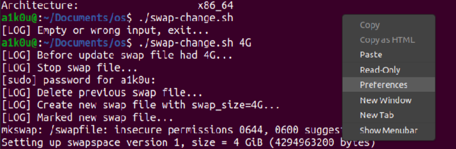

# Операционные системы

## System info

#### CPU
1. Какими способами можно узнать информацию о CPU? 

- `lshw` `lscpu` `cat /proc/cpuinfo` `sudo dmidecode --type processor`
- [Bash-скрипт](./cpu-info.sh), 
который выводит информацию о процессоре (_название, архитектуру,
число ядер, частоту работы и размер кэш-памяти_) в txt-файл.

#### RAM
2. Что такое RAM и Swap?


- `RAM` - оперативная память, также память с
произвольным доступом. Во время работы компьютера
каждая запущенная программа частично или полностью
загружается в RAM, сохраняя там команды, данные и 
промежуточные результаты для выполнения процессором.
Работа CPU с оперативной памятью <u>быстрее</u>, чем с 
жёстким диском или твердотельным накопителем.


- `Swap` - это процесс выделение виртуальной памяти,
другими словами, часть данных из RAM перемещается
на хранение в HDD или SSD. Использовать этот
механизм можно, например, когда требуется выделить
больше оперативной памяти, чем доступно.


3. Узнать всю информацию о RAM/Swap можно через
команду `free -h`, которая выводит удобочитаемую
сводку с автоматически выставленными единицами измерения.


4. Так как swap поддерживает влияние из вне, был
написан [bash-скрипт](./swap-change.sh), которому на вход подается один
обязательный аргумент с указанием количества выделенного
места. Для работоспособности прописываем 
`chmod u+x swap-change.sh`. Пример запуска:
`./swap-change.sh 1024M`. Скрипт также отлавливает
неверные входные данные (_1023Md, 3293, 
sdd1023.33M, 1g, g, ..._).


5. С помощью `sudo lshw -class memory` и 
`sudo dmidecode -t memory` можно узнать всю информацию
о RAM, в том числе: название (_product_, _Part Number_), 
производителя (_vendor_, _Manufacturer_), серийный номер
(_serial_, _Serial_), формат (_type_), объем (_size_, _Size_)
и частоту работы (_clock_).

#### Disk Usage
6. Очень длинная программа за счет конвейера,
которая выводит **размер свободного места на диске**.
Конечно, никто не мешает сократить её, засунув в 
bashrc с alias.
```bash
 df -h --total 
    | grep "total" 
    | grep -E -o "[0-9]+[BKMGTP]" 
    | echo "Available disk storage $(tail -1)"
 ```

7. Немного видоизмененная команда для вывода
используемого дискового пространства папкой /home.
```shell
df -h /home 
    | grep -E -o "[0-9]+[BKMGTP]" 
    | tail -2 
    | echo "/home used $(head -1) of disk storage"
```

8. Команда `top` предназначена для вывода
списка процессов компьютера.

#### GPU
9. Вывести информацию о GPU можно, например:
утилитой `glxinfo`, предварительно установив её
`sudo apt install mesa-utils`, а затем
`glxinfo -B | grep -A5 "Device:"`.

#### Network
10. [Bash скрипт](./ip-info.sh),
выводящий информацию (**_имя_, _IPv4_, _IPv6_, _MAC_**) для всех
сетевых устройств в human-readable формате. В конце
работы скрипта выводиться внешний IP адрес устройства.


11. В целом MAC-адрес можно получить различными способами, например:
через `ifconfig`, `ip`, но для удобства скрипт, указанный в 
[(9)](./ip-info.sh) пункте
решает поставленную задачу.


12. Подход к решению нахождения IP и MAC адреса PC может быть различен.
Например, информация об IP может быть найдена через `hostname -I`, `ip addr`,
`ifconfig`, `wget -qO- ident.me`.

#### Processes info
13. Список процессов, запущенных на компьютере, можно посмотреть
через `ps -e`, `top` и `htop`.

## System Environment
14. Создание переменных окружения происходит через команду
`export NAME=VALUE`. Вывести существующие переменные можно
через `printenv`, которые возможно изменять и выводить,
обращаясь к ним через `$`, например: `echo $LOGNAME`.

Изменения созданной/отредактированной переменной сохраняются
по-разному.

- Ввод команды `$ export VAR=128` в консоль позволит
переменной сохраниться до перезагрузки системы.
- Если ввести предыдущую команду в`.bashrc`, то она будет постоянной
для текущего пользователя.
- Однако в `etc/bashrc` эта переменная станет существовать для 
всех пользователей устройства.


15. `PATH` в первую очередь нужен системе, которая
запускает поиск исполняемого файла утилиты, введенную
пользователем в консоли. Написав свой скрипт, мы также
можем дописать к нему путь, обращаясь к нему из любого места.
Выполнить это можно командой `export PATH=$PATH:/home/scripts`, но
эта запись будет существовать вплоть до перезагрузки системы.
Если добавить её в `.bashrc`, то она будет доступна только для
определенного пользователя. Если же требуется дать доступ всей
системе, то модифицируем файл `/etc/environment`. Проверку
манипуляций можно провести через `echo $PATH`, где `$PATH` -
переменная окружения.


16. Для того чтобы обновить наши системные
библиотеки, восстановим ссылки на пакеты до
актуальных. После успешного выполнения
проведем скачиванием обновлений и установку 
их на наше устройство.

```shell
sudo apt update && sudo apt upgrade
```

17.


18. В предыдущих примерах мы убедились, что команды могут быть
чересчур длинными. В bash-скриптах мы могли присвоить значение 
выполнения той или иной утилиты, а можно ли _назначить короткое
имя длинной команде_? `alias` позволяет нам сделать это. Давайте
создадим постоянные команды для выхода из директорий на 1-3 ступени выше.

```shell
> nano ~/.bashrc

# после открытия добавляем строки
alias ..='cd ..'
alias ...='cd ../..'
alias ....='cd ../../..'

# сохраняем и обновляем bashrc
> . ~/.bashrc
```

19. Перестало нравиться состояние консоли?
Делаем левый клик мышью на свободном месте консоли,
затем переходим в `Preferences`. Откроется окно, в котором
можно сделать различные изменения (_шрифт, цвет, ..._) в консоли.

> 

20. Создадим виртуальное окружение для `Python` в папке
`/home` командой `sudo python3 -m venv /home/upython`.
Теперь добавим в `.bashrc` короткую команду `psv`
(_Python start virtual environment_)
для активации нашего venv.

```shell
alias psv='source /home/upython/bin/activate'
```


## Grep

21. **Grep** - утилита, с помощью которой можно искать паттерны
в текстовых файлах. По большей части под шаблонами (паттернами)
понимается какое-то регулярное выражение.

- Представим, что у нас появился доступ
к электронным письмам Хилари Клинтон.
И нам захотелось узнать о количестве
упоминаний Уганды в её сообщениях.

```shell
grep -w -c "Uganda" Emails.csv
```

- Помимо Уганды интересно узнать о суммарном количестве
упоминаний Таджикистана и Узбекистана в одном вызове.

```shell
grep -E -w -c "Tajikistan|Uzbekistan" Emails.csv
# можно перечислить неограниченное 
# количество паттерном через |
```

- В соответствии с множественным перечислением паттернов
следует то, что количество передаваемых файлов для grep
также не ограничено. 

Найдем все упоминания слова "мир" (_во всех склонениях 
единственного числа_) во всех томах романа-эпопеи 
Льва Толстого "Война и мир".

```shell
grep -E -w -i "мир|мира|миру|миром|мире" \
              Tom1.txt Tom2.txt Tom3.txt Tom4.txt
```

22. Флаг `-i` ~ `--ignore-case` в grep отвечает за то,
что убирает чувствительность к регистру в шаблонах.


23. Флаг `-w` ~ `--word-regexp` выбирает только те строки,
где слово выделяется целиком по шаблону (_не является подстрокой_).


24. Флаг `-v` ~ `--invert-match` выводит все строки, не содержащие
паттерн, например: `grep -w -i -v "love" Shakespeare.txt` выводит
все строки, где нет слова "love".


25. Выведем содержимое файлов, чей суффикс содержит
`info` в папке `/proc`. Воспользуемся синтаксисом
bash прямо в консоли.

```shell
for file in $(ls /proc | grep "info"); do cat /proc/"$file"; done;
```


26. Добавив флаг `-n` в `grep` мы можем выводить в
нумерованном порядке строки, где нашлась шаблонная
подстрока, например `grep -n 'com' Emails.csv`.

> _Разбавим README мини-анектодом._
> 
> У программиста была одна проблема. Он решил эту проблему
> с помощью регулярного выражения. Теперь у программиста
> есть две проблемы!

27. Воспользуемся базовым синтаксисом регулярных выражений.
Найдем все слова, в которые точно выходит одна буква `h`, а после
следует любой `символ`. Любое количество букв `l`, точно больше одной
буквы `о`, какой-то `возможный разделитель` и в конце входящее или
не входящее слово `world`.
```shell
grep -R -w "[h]{1}.l*[o]+[\W]?(world)?" someFile.txt
```

28. Команда `ls /lib | grep -E "*\.so"` находит все файлы с расширением
`.so`. Добавив флаг `-r`, мы можем рекурсивно обойти все поддиректории,
найдя файлы по шаблону.


29.


30.


31. Допустим, нам нужно вывести все процессы от действующего
пользователя. Решить поставленную задачу можно так:
`top -n 1 -b | grep $USER`. 